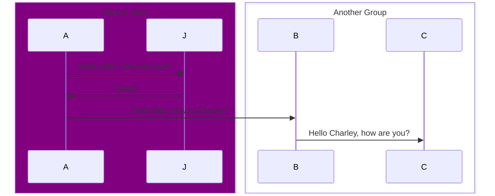

# Unity Animator Extension

Unity의 Animator에서 사용되는 `StateBehaviourMachine`를를 통해 이벤트를 제어하는 에셋입니다.

스크립트에서 `AnimationEventAttribute`가 지정된 함수를 대상으로 애니메이터 뷰에서 이벤트를 등록할 수 있습니다.

기본 데이터 타입부터 커스텀 데이터 타입까지 직접 이벤트로 전송이 가능합니다.

- [사용방법]()
    + [1]()
    + [2]()
    + [3]()
    + [4]()
- [AnimationEventController]()
    + [1]()
    + [2]()
- [시스템 작동 시퀸스]()

<br>

# 사용 방법


1. `Animator`와 같은 게임 오브젝트 계층에 `AnimationEventController` 컴포넌트를 부착합니다.

2. Animator View 를 열고 이벤트를 송신할 애니메이션 노드에 `StateBehaviourMachine` 를 부착합니다.

3. `StateBehaviourMachine`가 `AnimationEventController`컴포넌트가 부착된 계층부터 하위계층으로 <br>
   `MonoBehaviour`를 상속한 컴포넌트를 순회하며 `AnimationEventAttribute`가 수식된 메서드들을 찾습니다.

4. `StateBehaviourMachine`에서 등록하고 싶은 메서드를 선택합니다. 해당 메서드가 받을 매개변수 타입이 자동으로 설정됩니다.

5. `StateBehaviourMachine`에서 이벤트를 송신할 타이밍을 선택합니다.

6. 실행하면 애니메이션이 재생되면 등록된 타이밍에 이벤트가 송신되고 `AnimationEventController`에서 인자 전달과 함께 호출됩니다. 


```C#
public class EventExample : MonoBehaviour
{
    [AnimationEvent("Print Message A", EAnimationEventParameter.Void)]
    public void Print() => Debug.Log("Call Event A");

    [AnimationEvent("Print Message B", EAnimationEventParameter.Void)]
    public void Print() => Debug.Log("Call Event B");

    [AnimationEvent("Print Message C", EAnimationEventParameter.Void)]
    public void Print() => Debug.Log("Call Event C");
}
```

<br>

## 지원하는 기본 매개변수 타입 종류

AnimationEventAttribute의 생성자 매개변수로써 이벤트 호출시 메서드가 받을 데이터의 매개변수 타입입니다.

메서드의 매개변수 설정시 `StateEventBehaviour` 에서 자동으로 메서드를 읽어 가져옵니다.


```C# 
public enum EAnimationEventParameter
{
    Void,
    Int,
    Float,
    Bool,
    String,
    Tag,
    LayerMask,
    Color,
    Vector2,
    Vector3,
    Quaternion,
    Object,
    GameObject,
    AnimatorInfo,
    AnimationCurve,
    Customization
};
```

> [EAnimationEventParameter.cs]()


<br>

## 지원하는 전송 타이밍 종류

|이름|설명|
|-----|-----|
|None|이벤트를 송신하지 않습니다.|
|Start|반복 애니메이션일 경우 재시작할때마다 이벤트를 송신합니다.|
|Enter|타 애니메이션 노드에서 해당 애니메이션 노드로 진입할 때 이벤트 송신합니다.|
|Update|애니메이션이 재생 중일때 매 프레임 이벤트를 송신합니다.|
|End|반복 애니메이션일 경우 종료될때마다 이벤트를 송신합니다.|
|Exit|현재 애니메이션 노드에서 타 애니메이션 노드로 진입할 때 이벤트 송신합니다.|
|Point|지정한 Normalized Time에 이벤트를 송신합니다.|
|Range|지정한 Normalized Time 범위일때 매 프레임 이벤트를 송신합니다. |


```C#
public enum EEventDispatchType
{
    None,
    Start,
    Enter,
    Update,
    End,
    Exit,
    Point,
    Range
};
```
> [EEventDispatchType.cs]()

<br>

## 스크립트에서 어트리뷰트 지정 방법

어트리뷰트를 지정한 메서드를 이벤트로 사용하려면 해당 메서드가 `MonoBehaviour`를 상속한 컴포넌트여야 가능합니다.


```C#
public class EventExample : MonoBehaviour
{
    [AnimationEvent("Print Log", EAnimationEventParameter.Void)]
    public void Print() 
    {
        Debug.Log("Event");
    }


    [AnimationEvent("Print Message", EAnimationEventParameter.String)]
    public void LogIntMessage(string a) 
    {
        Debug.Log(a);
    }

    [AnimationEvent("Send Object", EAnimationEventParameter.Object)]
    public void GetObject(Object a)
    {
        Debug.Log(a.name);
    }
}
```

> [AnimationEvent.cs]()


<br>

## Animation Info

Unity Animation Extension에서 제공하는 구조체로 해당 이벤트를 송신한 애니메이션 노드의 레이어 인덱스와 노드의 이름, 노드의 태그 등의 각종 정보를 전달합니다.

```C#
[Serializable]
public struct AnimationInfo
{
    public int layerIndex;
    public string nodeName;
    public string nodeTag;
    
    public AnimatorStateInfo stateInfo;
    public AnimatorTransitionInfo transitionInfo;
    public AnimatorClipInfo[] clipInfos;
}
```

> [AnimationInfo.cs]()

<br>

## 커스텀 매개변수 타입
`CustomAnimationEventParameter` 클래스를 상속시켜 만들 수 있습니다.


```C#
[Serializable]
public abstract class CustomAnimationEventParameter
{
    public int layerIndex { get; set; }

    public AnimatorClipInfo[] clipInfo { get; set; }

    public AnimatorStateInfo stateInfo { get; set; }
    
    //이벤트가 발동되기 직전에 호출되는 이벤트 메서드
    public virtual void OnBeforeEventTrigger() { }

    //이벤트가 발동된 직후 호출되는 이벤트 메서드
    public virtual void OnAfterEventTrigger() { }
}
```

> [CustomAnimationEventParameter.cs]()

<br>

## 사용 예제


```C#
public class CustomAnimEventParamExample : CustomAnimationEventParameter
{
    public string eventName;
    public int eventParameter;
    public List<string> animationNameList;
}
```
> [CustomAnimEventParamExample.cs]()


<br>

`CustomAnimationEventParameter`를 상속한 타입을 매개변수로 받기 위해선 typeof로 하위 객체의 타입을 인자로 전달해야됩니다.

```C#
public class EventExample : MonoBehaviour
{
    [AnimationEvent("Get Custom", EAnimationEventParameter.Customization, typeof(CustomAnimEventParamExample))]
    public void GetCustom(CustomAnimationEventParameter param)
    {
        CustomAnimEventParamExample p = (CustomAnimEventParamExample)param; 

        Debug.Log($"{p.eventName} {p.eventParameter} {p.animationNameList.Count}");
    }
}
```

<br>

# AnimationEventController

`StateEventBehaviour` 로부터 이벤트를 전송받아 실행하는 역할을 담당합니다.

> [AnimationEventController.cs]()


### 에디터

등록된 애니메이션 이벤트 리스트를 인스펙터상에서 제공합니다. (미구현)

디버그를 활성화 및 비활성화할 수 있습니다.

---

### 스크립트

특정 애니메이션 이벤트 비활성화 및 활성화할 수 있습니다.
```C#
public void SetActiveEvent(string eventName, bool active) { ... }

public void SetActiveEvent(int eventNameHash, bool active) { ... }
```
<br>


체이닝 방식으로 애니메이션 시퀸스를 등록할 수 있습니다. (미구현)
```C#
```

<br>

# 시스템 작동 시퀸스

